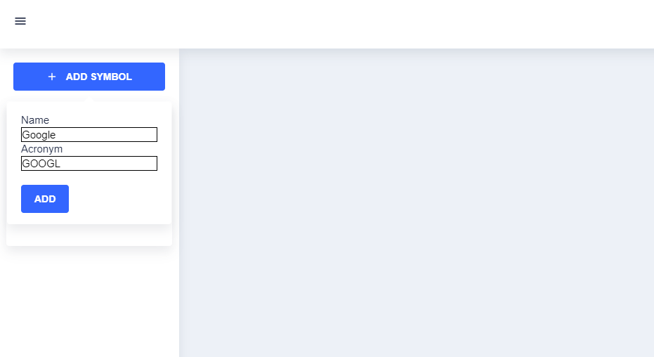
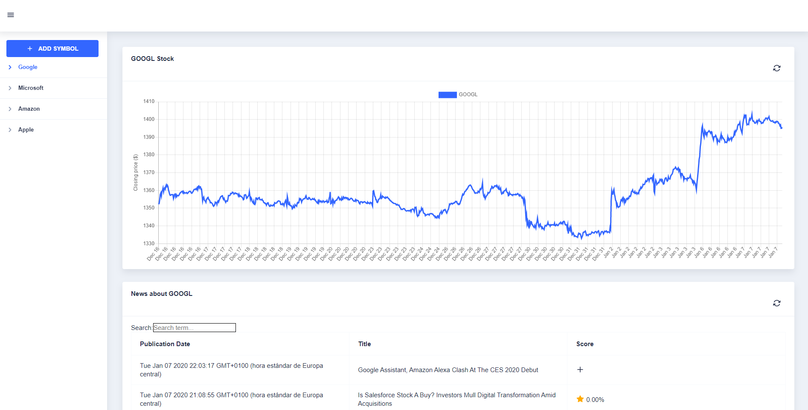
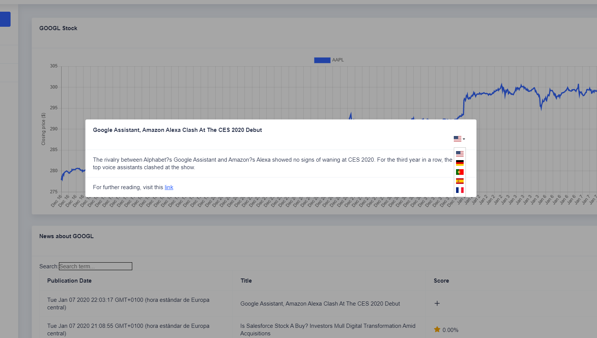

# Stocks Visualization
Esto es el proyecto final de ASR. Consiste en una interfaz Angular que accede con un servidor Tomcat a los siguientes servicios de IBM Cloud.
- Traductor
- Cloudant
- Natural Language Understanding

Además, se accede a dos APIs externas para la obtención de los datos.
- Yahoo RSS Feed
- Alpha Vantage

El código fuente para la plantilla Angular se encuentra en el siguiente enlace: (https://github.com/pmurcia/ngASR).

Se puede acceder a la aplicación con el siguiente enlace: (https://stock-visualization.eu-gb.mybluemix.net)

# Partes de la aplicación
En la pantalla inicial, veremos que falta información. Para meter un nuevo símbolo para observar, hacemos click en el botón **ADD SYMBOL**. Nos mostrará un menú que nos permitirá meter un nombre para identificar el símbolo en el menú lateral, y el símbolo empleado en la bolsa.

Cuando lo creamos, nos muestra la información guardada en el servidor sobre anteriores consultas de ese símbolo. En caso contrario, nos aparecen dos paneles en blanco.
Para obtener nueva información, le damos click al botón de sincronización que se encuentran en las esquinas superiores derecha de cada panel.

En cuanto a la tabla de noticias, al hacer click en cualquiera de las filas nos mostrará un modal para visualizar y elegir el idioma al que se traducirá el artículo.
Para cerrar el modal, se puede hacer click fuera del modal o darle a la tecla `ESC`.

En cada fila hay un `+` por defecto. Si se hace click en él, se realizará una valoración del artículo. Aunque aparezca el modal, si se sale de él aparecerá la valoración.